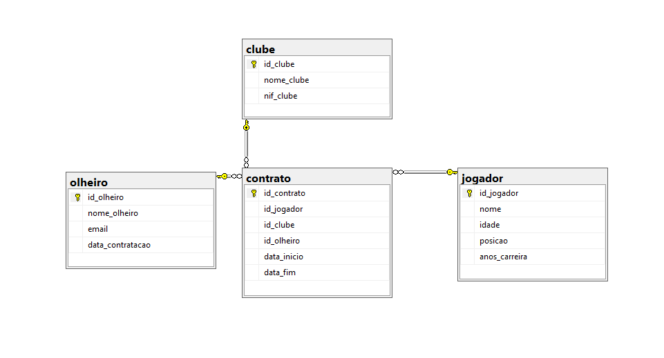

# ⚽ Football Contract Management & Analytics (SQL Server)

This project demonstrates the design, implementation, and analysis of a relational database for managing football contracts between players, clubs, and scouts.

## 📌 Project Overview
The goal was to create a robust structure to track professional relationships in sports, ensuring data integrity and providing strategic business insights through complex T-SQL queries.

## 🛠️ Tech Stack & SQL Concepts
- **Engine:** Microsoft SQL Server (T-SQL)
- **Modeling:** 4 Entities (Clubs, Players, Scouts, Contracts) with 1:N and N:M relationships.
- **Data Integrity:** `PRIMARY KEY`, `FOREIGN KEY`, `UNIQUE`, and `CHECK` constraints.
- **Advanced Querying:**
  - **Joins:** Inner, Left, and Right Joins to map player history.
  - **Aggregations:** KPI calculation (average age, total career years, contract counts).
  - **Subqueries:** Correlated and Non-Correlated subqueries for deep filtering.

## 🔍 Key Insights Solved
1. Identifying players without active contracts.
2. Ranking scouts by their contract intermediation volume.
3. Filtering clubs where the entire squad meets specific career experience criteria.

## 📂 How to run
1. Run `tables.sql` to create the structure.
2. Run `inserts.sql` to populate the database.
3. Explore `queries.sql` to see the analytical queries in action.
